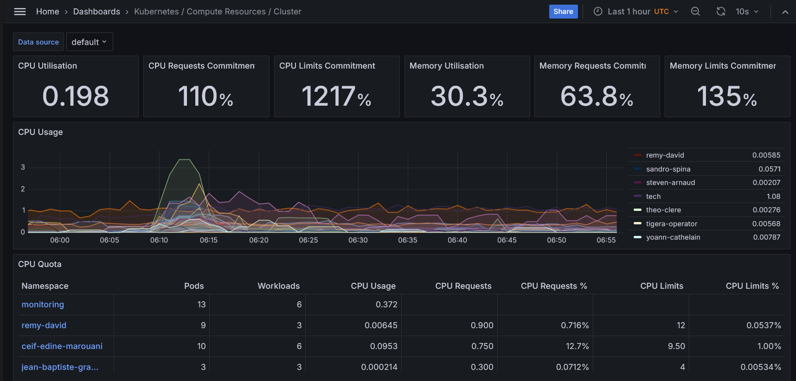
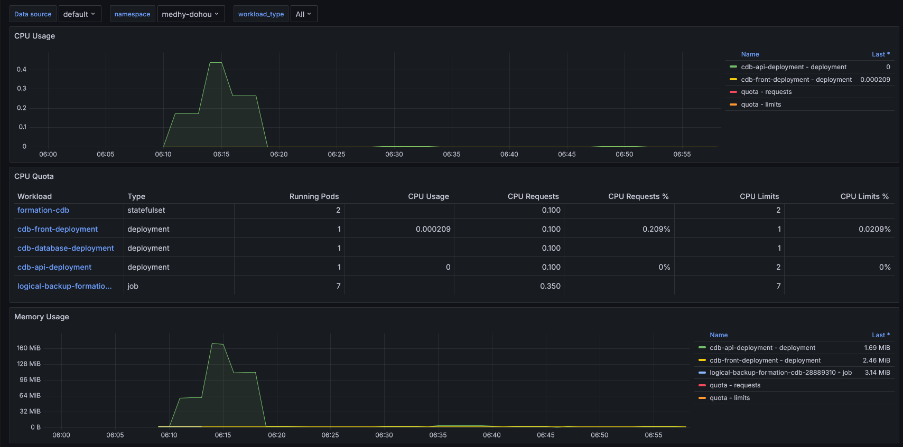
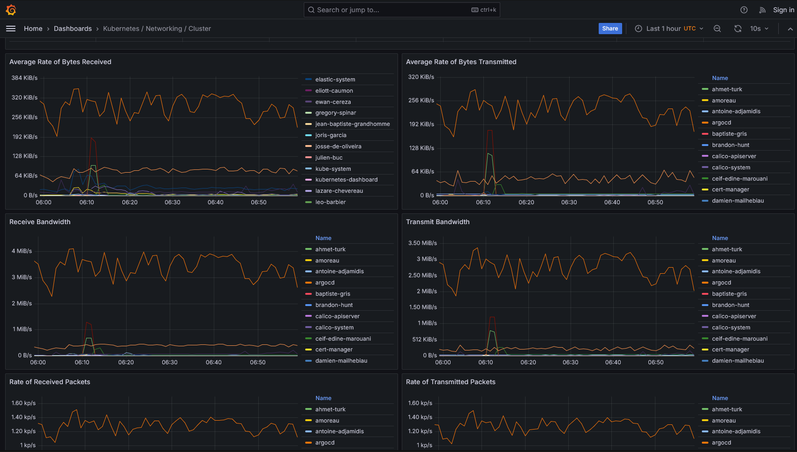
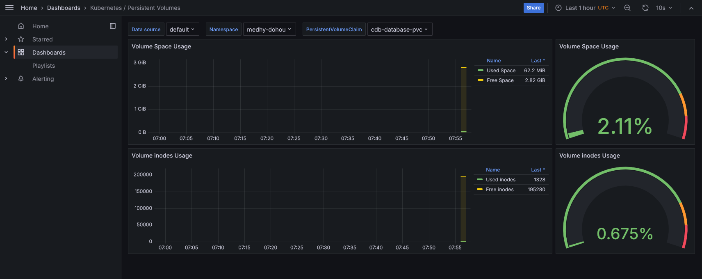

# Day 4 - DevOps 2 - Medhy DOHOU - IRC 2025
Lien github : https://github.com/cpe-lyon/DevOps-2-DOHOU/tree/day4

## Avec cette approche : Quelle est le rôle de Prometheus ? Quelle est le rôle de Grafana ?

Prometheus collecte les différentes métriques : utilisation CPU, utilisation RAM, nombres de pods etc...
Grafana aggrège les données collectées par Prometheus et permet la construction de dashboards avec des graphiques.

## Récupérez un état des lieux des ressources CPU et RAM utilisé ou requise au niveau du cluster Kubernetes entier

## Récupérez le graphe de la RAM utilisée sur votre propre namespace

## Récupérez un état des lieux de la bande passante utilisé au niveau du cluster Kubernetes entier

## Récupérez le monitoring de l'espace utilisé par votre volume persistant de votre base de données (ou le volume primaire dans le cas où vous utilisez l'operator postgreSQL)

